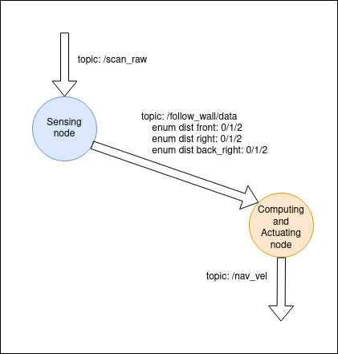

# Follow Wall task

In this task the robot will approach a wall and follow its countour

# Members of L4ROS2
- Javier de la Canóniga: @javi-dbgr
- Iván López: @ivrolan
- Alejandro Moncalvillo: @Amglega
- Unai Sanz: @USanz

# Practice scheme

