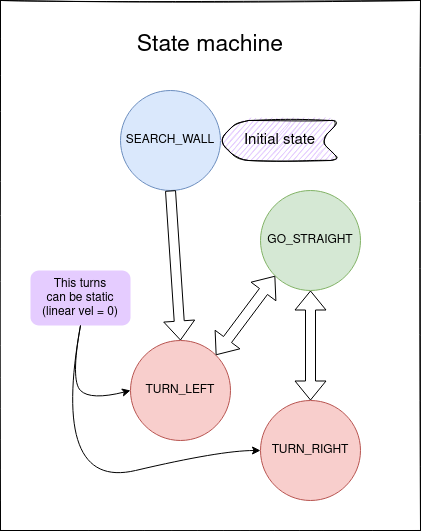

# Follow Wall task

In this task the robot will approach a wall and follow its countour.

# Members of L4ROS2

- Javier de la Canóniga: @javi-dbgr
- Iván López: @ivrolan
- Alejandro Moncalvillo: @Amglega
- Unai Sanz: @USanz

# Node diagram

# Sensing node scheme

# Actuation node diagram (state machine)

